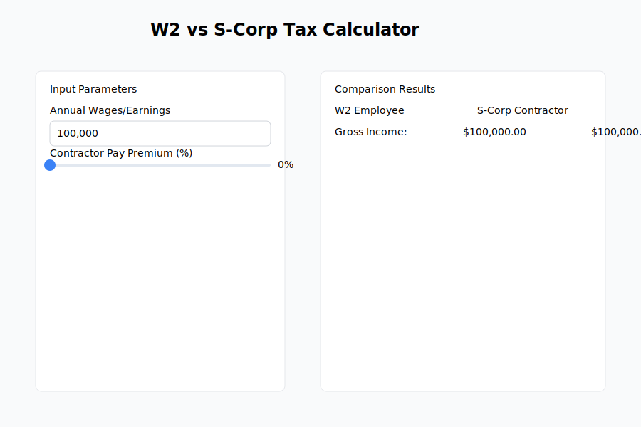

# W2 vs S-Corp Tax Calculator

An interactive calculator that compares the tax implications of W2 employment versus S-Corp contractor status.

## Features

- All 50 states tax brackets and fees (2024 rates)
- Federal tax calculations
- FICA taxes and Medicare
- QBI deduction calculations
- R&D tax credits
- Business expense deductions
- Interactive UI with real-time updates

## Usage

Visit: https://henrythe9th.github.io/tax-calculator/

Input your:
1. Annual wages/earnings
2. Contractor pay premium
3. Salary/dividend split
4. R&D percentage
5. Health insurance costs
6. Business deductions

The calculator will show a side-by-side comparison of W2 vs S-Corp scenarios, including all taxes, deductions, and the final net income difference.

## State-Specific Features

- Accurate state income tax brackets for all 50 states
- State-specific S-Corp fees (LLC fees, franchise tax, annual reports)
- Automatic fee updates when switching states
- Special handling for states with no income tax

## Tax Calculations Include

### Federal
- 2024 tax brackets
- Standard deduction ($14,600 for single filer)
- FICA taxes (Social Security up to $168,600)
- Medicare taxes (including Additional Medicare Tax)
- QBI deduction (20% of qualified business income)
- R&D tax credits (6.5% of qualifying expenses)

### State
- State-specific income tax brackets
- Annual LLC/corporation fees
- Franchise taxes where applicable
- Annual report fees

### Business Deductions
- Travel expenses
- Commuting costs
- Home office deduction
- Meals (50% deductible)
- Cell phone expenses
- Augusta rule (14-day home rental)
- Health insurance premiums
